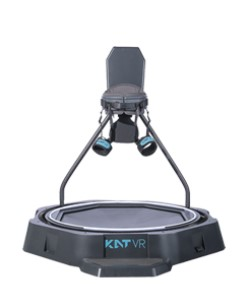
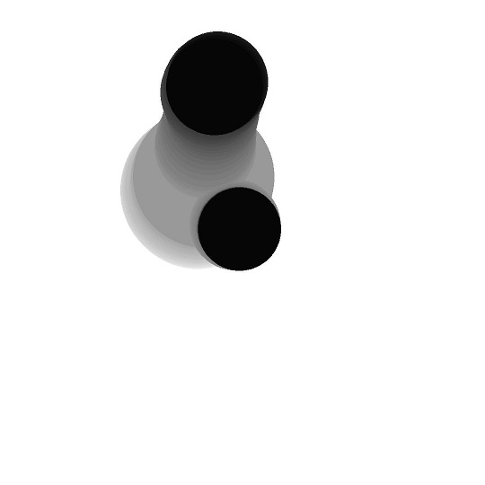
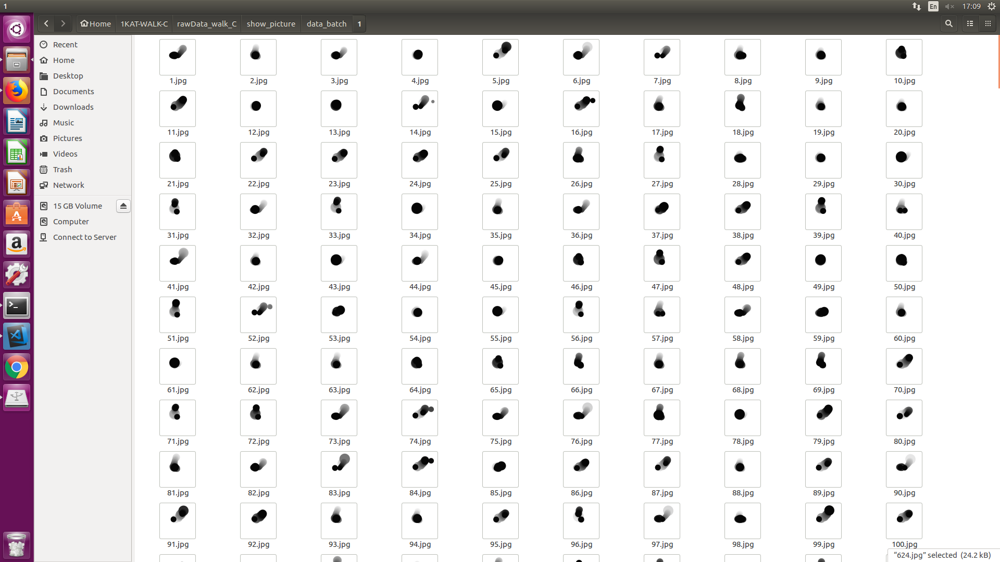
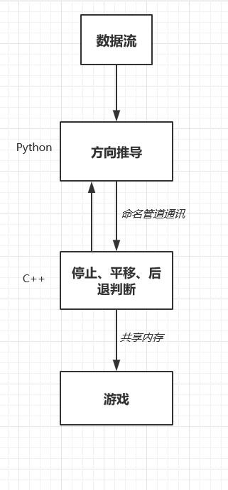

# 项目简介
此项目启动于2018.3.18，主要为了解决现阶段中游戏设备在游玩时会发生角度偏转的问题。模型的训练在Ubuntu上完成，效果测试则在windows下游戏内完成。


# 工具及平台
 - Pytorch(Python)
 - C++
 - Ubuntu 16.04
 - windows 10
  
# 问题的产生
现有的设备因为硬件与软件的一定关系，导致其在使用的过程中会产生角度偏转。会使游戏玩家在使用过程中找不到正确的方向，所以我提出使用深度学习的方案来解决这个问题，使用玩家的脚步数据来判断方向。早期预研过程中所要考虑的因素较多，包括：算力、硬件读取速度、识别精度等。整个预研过程我花了大概1个星期，其中包括整个项目进度的细节估时都在内。硬件设备如图：



# 解决的方案
考虑到脚步数据在时间轴上会有前后关系，本来打算使用在时间轴上表现较好的模型来测试。但是传感器在实际表现过程中却不是很稳定，总是会产生干扰信号，且无规律，加多种滤波后皆无果。因此若按每帧来判断数据，在后期的测试过程中解决此问题所花的时间与精力一定会很多。因此放弃了这个想法，最后在多次观测数据形式的情况下，决定以多帧的数据绘制成一幅画来进行方向判断，此时也可以将时间轴上的数据用二维平面来表达，一举多得(脚步数据来源于设备底部红外八边框)。

| |单帧|多帧|
|:---|:---|:---|
|时间|响应快|响应慢|
|准确率|低|高|
|内存|少|多|


将多帧绘在同一画内，其效果如下：



此图是由连续的30帧绘制，是我本人在设备上朝一个方向行走的数据，使用的是OpenCV，圆形图案代表一只脚的位置，颜色深浅代表时间轴，越深越近。圆形图案使用的是cv2中的ellipse函数，其边界插值方法自行查询。因为在设备上行走过程中，脚的落点与朝向会有关系，因此不能对数据使用Location方法来进行数据定位，直接对整幅图进行推导即可。

我将八边框平均分成了16个方向，每个方向采集一组数据，将整个工程做成一个分类问题来解决。每个文件下大概有3000张左右图片,数量大致保持一致,人工删选.文件夹结构如下：
>DataSet  
  >>train    
  >>>1   
  >>>2  
  >>>...   
  >>>16  
>
>>val
>>>1  
>>>2  
>>>...  
>16  

模型选择方面，既然已经选择了画面的抽象表现方式，那肯定是从ResNet开始做，从ResNet18开始测试。前期考虑时，打算按下面顺序测试模型：
- ResNet18
- ResNet18 改编
- ResNet34
- ResNet34 改编
如果以上的方法，都不行的话，则需要考虑其他模型方案，因为深度带来的内存损耗太大，VR游戏其本身也需要大量的GPU与显存。不过幸好的是，在测试ResNet18的时候，数据表现形式就算不错了，在识别率上接近100%，因此说明ResNet本身对于此种情况下的数据识别较好，可以直接使用这个模型。同时因为Pytorch本身带有ResNet18模型
```
models.resnet18()
```

数据采集过程中，每个方向大约行走1分半种，每个方向需要不断保持行走姿势，不能停下，且因为数据的不稳定性，所以要在设备上尽量仿造新手的行走姿势，以及内八，外八等姿势。具体的行走方案，我做了一套行走姿势规定，这里就不赘述了。

在训练过程中需要先对数据经行打乱，防止生成数据规律对梯度产生影响。下图是打乱后的一组数据:

每幅图之间不存在时间上的明显关系。


在模型训练过程中损失函数使用交叉熵
```
nn.CrossEntropyLoss()
```
优化器选择随机梯度下降:
```
optim.SGD()
```
并且添加一个Ganna函数，用于调整学习速率，加快学习速度。
```
SetpLR( ,step_size=5,gamma=0.1)
```
在多次测试batch_size变量大小后，考虑到内存大小与拟合状态，将其选择为16，一次前向推导使用16个数据。当然，可能会有更好的数据size大小，但是考虑到项目进度，就选择16了。
在完成配置后，一个epoch大约为40分钟：电脑配置如下:
- i5-4460 cpu @ 3.20GHz * 4
- GeForce GTX 970
- Memory  8G
  
当然，在开发过程中也考虑过更换好的配置，但是对于短期开发来说意义并不大。不过更好的配置会提高项目的容错率，即模型的试错。

在epoch的选择上，我是从200开始测试，观察准确率，最后才降到25。对于达到要求准确率的模型都进行保存，最后实机测试选出最好的模型。

# 后期逻辑
由于后期突然来的需求，使用方要求还需要实现停止、平移、后退等功能。当时如果继续采用深度学习的方法，则从数据采集开始，需要很多时间，明显从项目进度上是不够的。所以我以数据逻辑来判断停止、平移、后退，以深度学习方案实现方向判断，具体的框架逻辑如下：


# 感悟及期望
整个项目由我一人完成，从立项到完成历史约4个月。本人觉得还可以在后期优化的几个点
- 在分类过程中，使用的是Pytorch提供的数据保存模式，但是使用此方法，会使加载的图片强制读成3通道，不知道1.0中是否由相关的函数改变（开发过程中，Pytorch 1.0推出，也是苦笑不得）如果可以的话，理论上可以提高近一半的推导时间，不知道精度是否好。
- 在模型训练过程中可以通过改变参数，提高模型对更少的帧数的识别率，而在实际过程中使用更多的帧数来参与推导。举个例子：使用30帧参与模型训练，而使用35或40帧的数据来实机判定方向。
